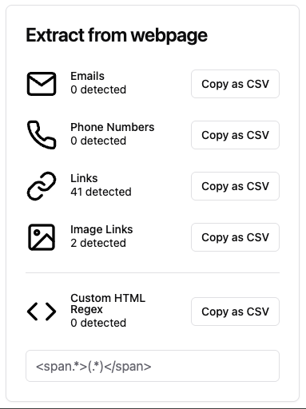

# Webpage String Extractor Browser Extension

An extension that extracts various types of information from any webpage.

Built using [Plasmo](https://www.plasmo.com/), [React](https://reactjs.org/), and [Shadcn UI](https://ui.shadcn.com/).  
Compatible with Google Chrome (Manifest V3).



## Features

- **Email Extraction**: Finds and lists all email addresses on the current webpage.
- **Phone Number Extraction**: Identifies and displays all phone numbers on the page.
- **Link Extraction**: Captures all hyperlinks on the page.
- **Image Extraction**: Gathers image sources (URLs).
- **Custom Regex Extraction**: Enter any regex pattern to search the page’s raw HTML and automatically see matches as you type.

---

## Installation

[Download the latest version (v0.0.2)](https://github.com/ArthurVerrez/webpage-string-extractor-browser-extension/releases/download/v0.0.2/webpage-string-extractor-v002.zip).

1. **Unzip** the downloaded file to a folder on your computer.
2. **Open Chrome** and go to `chrome://extensions/`.
3. **Enable Developer Mode** (toggle in the top-right corner).
4. Click **Load unpacked** and select the folder you just unzipped.
5. The extension should now appear in your list of installed extensions.

Notes:

- The first time you load the extension, you might need to refresh the page you want to extract data from if it was opened before installing the extension.
- If you move the extension folder, you will need to reload it in Chrome, so keep it in a stable location.
- The above process is for Chrome. Other Chromium-based browsers (Edge, Brave, etc.) have similar steps.

---

## Development

If you want to actively develop or modify the extension, use the following workflow:

1. **Clone & Install**:
   ```bash
   git clone https://github.com/ArthurVerrez/webpage-string-extractor-browser-extension
   cd webpage-string-extractor-browser-extension
   pnpm install
   ```
2. **Start the Dev Build**:

   ```bash
   pnpm dev
   ```

   This command watches for file changes and updates the extension build in real time.

3. **Load Unpacked** in Chrome ([Official Chrome Guide](https://developer.chrome.com/docs/extensions/get-started/tutorial/hello-world#load-unpacked)):

   - Navigate to `chrome://extensions/`
   - Ensure **Developer mode** is enabled.
   - Click **Load unpacked** and select the generated `chrome-mv3-dev/` folder.

4. **Iterate & Refresh**:
   - Whenever you make changes, the build folder is updated automatically.

---

Happy extracting! If you encounter any issues or have suggestions, please [open an issue](https://github.com/ArthurVerrez/webpage-string-extractor-browser-extension/issues).
